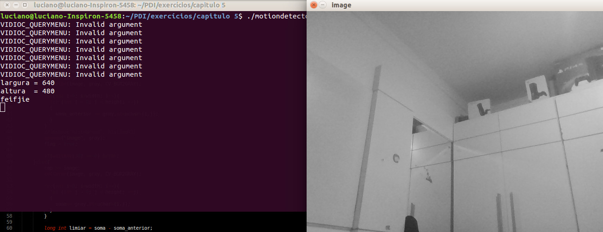
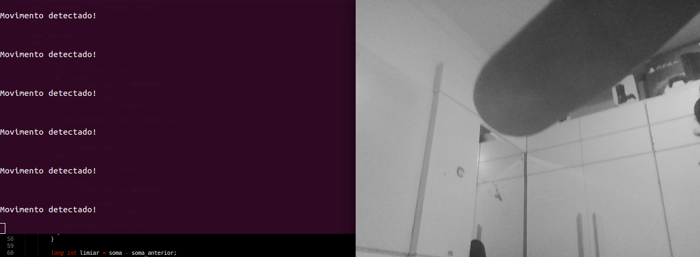
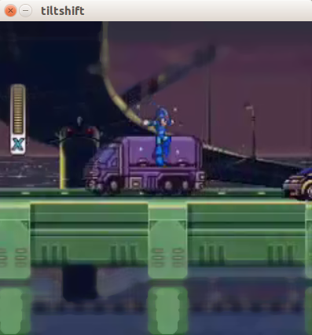

:source-highlighter: prettify
:toc: left
:toc-title: Sumário
:imagesdir: https://raw.githubusercontent.com/Lucianorlneto/lucianorlneto.github.io/master/
:last-update-label!:

= Resolução dos exercícios de PDI
:author: Luciano Rodrigues Lucio Neto
:email: lucianorlneto@gmail.com

== Observação
Todos os exercícios são propostos no tutorial de OpenCV do professor Agostinho, UFRN, http://agostinhobritojr.github.io/tutoriais/pdi/

== 1. Seção 3: Manipulando _pixels_ em uma imagem

=== 1.1 Exercício 1

Utilizando o programa exemplos/_pixels_.cpp como referência, implemente um programa regions.cpp. Esse programa deverá solicitar ao usuário as coordenadas de dois pontos P1 e P2 localizados dentro dos limites do tamanho da imagem e exibir que lhe for fornecida. Entretanto, a região definida pelo retângulo de vértices opostos definidos pelos pontos P1P1 e P2P2 será exibida com o negativo da imagem na região correspondente. O efeito é ilustrado na Figura Regiões.

==== Resolução

Para calcularmos o negativo de uma deteminada área retangular, passamos quatro parametros de entrada para o programa e, dentro dessa área determinada, fazemos,
para uma imagem em tons de cinza, 255 - x, onde x é a cor da imagem num determinado _pixel_. +
Abaixo temos o código:

[sidebar]
****
.regions.cpp
[source,c++]
----
#include <iostream>
#include <stdlib.h>
#include <cv.h>
#include <highgui.h>

using namespace cv;
using namespace std;

struct ponto{
  int x, y;
};

int main(int argc, char** argv){
  Mat image;

  ponto p1, p2;

  if(argv[1] == NULL || argv[2] == NULL || argv[3] == NULL || argv[4] == NULL){
    cout << "\nPasse as coordenadas dos pontos p1 e p2. Ex.: 130 140 20 100\n";
    exit(1);
  }

  p1.x = atoi(argv[1]);
  p1.y = atoi(argv[2]);
  p2.x = atoi(argv[3]);
  p2.y = atoi(argv[4]);

  image= imread("biel.png",CV_LOAD_IMAGE_GRAYSCALE);
  if(!image.data)
    cout << "nao abriu biel.png" << endl;

  namedWindow("janela",WINDOW_AUTOSIZE);

  for(int i=p1.x;i<p1.y;i++){
    for(int j=p2.x;j<p2.y;j++){
      image.at<uchar>(i,j)= 255 - image.at<uchar>(i,j);
    }
  }
  
  imshow("janela", image);  
  waitKey();

  return 0;
}

----
****

Os resultados são mostrados abaixo:
image:exercicio%203.1%20(regions).png[]

=== 1.2 Exercício 2

Utilizando o programa exemplos/_pixels_.cpp como referência, implemente um programa trocaregioes.cpp. Seu programa deverá trocar os quadrantes em diagonal na imagem. Explore o uso da classe Mat e seus construtores para criar as regiões que serão trocadas. O efeito é ilustrado na Figura Troca de regiões.

==== Resolução

Para trocar as regiões da imagem, foram utilizados métodos do OpenCv que capturam um retangulo determinado por dois pontos e o copia para uma certa área de uma imagem.
Os métodos foram Rect e copyTo como pode-se ver no código abaixo:

[sidebar]
****
.trocaregioes.cpp
[source,c++]
----
#include <iostream>
#include <stdlib.h>
#include <cv.h>
#include <highgui.h>

using namespace cv;
using namespace std;

struct ponto{
  int x, y;
};

int main(int argc, char** argv){
  Mat image;

  image= imread("biel.png",CV_LOAD_IMAGE_GRAYSCALE);
  if(!image.data)
    cout << "nao abriu biel.png" << endl;

  namedWindow("janela",WINDOW_AUTOSIZE);

  Size tamanho = image.size();

  Mat final = image.clone();

  Mat copia1(image, Rect(0,0, tamanho.height/2, tamanho.width/2));
  Mat copia2(image, Rect(tamanho.width/2,0, tamanho.height/2, tamanho.width/2));
  Mat copia3(image, Rect(0,tamanho.height/2,tamanho.height/2,tamanho.width/2));
  Mat copia4(image, Rect(tamanho.height/2,tamanho.width/2, tamanho.height/2, tamanho.width/2));

  copia4.copyTo(final(Rect(0,0, tamanho.height/2, tamanho.width/2)));
  copia1.copyTo(final(Rect(tamanho.height/2,tamanho.width/2, tamanho.height/2, tamanho.width/2)));
  copia2.copyTo(final(Rect(0,tamanho.height/2,tamanho.height/2,tamanho.width/2)));
  copia3.copyTo(final(Rect(tamanho.width/2,0, tamanho.height/2, tamanho.width/2)));

  namedWindow("janela2", WINDOW_AUTOSIZE);
  
  imshow("janela", image);
  imshow("janela2", final);  
  waitKey();

  return 0;
}
----
****

Abaixo temos o resultado em uma imagem:
image:exercicio%20trocaregioes.png[]

== 2. Seção 4: Preenchendo regiões

=== 2.1 Exercício 1

Observando-se o programa labeling.cpp como exemplo, é possível verificar que caso existam mais de 255 objetos na cena, o processo de rotulação poderá ficar comprometido. Identifique a situação em que isso ocorre e proponha uma solução para este problema.

==== Resolução

Existem várias soluções para o problema. Uma delas é utilizar mais que 8 bits para a quantidade de tons de cinza, porém, dessa maneira, sempre haverá limitação para o número de objetos na imagem. Outra solução é, se a imagem possuir cor de _background_ fixa, pode-se, assim que for encontrada uma cor diferente da do _background_, preencher aquele espaço diferente com a cor de fundo da imagem e contar +1 para cada operação similar. 

=== 2.2 Exercício 2

Aprimore o algoritmo de contagem apresentado para identificar regiões com ou sem buracos internos que existam na cena. Assuma que objetos com mais de um buraco podem existir. Inclua suporte no seu algoritmo para não contar bolhas que tocam as bordas da imagem. Não se pode presumir, a priori, que elas tenham buracos ou não.

==== Resolução

Primeiro é necessário varrer os _pixels_ das bordas e, se houver algum objeto, preenche-lo da mesma cor do _background_, tirando objetos da borda da imagem. Após isso, é pintado o fundo da imagem para uma cor diferente da cor dos buracos dos objetos. Com esse tratamento, identifica-se os objetos com buracos verificando os _pixels_ pretos. Para desconsiderar mais de um buraco em um bojeto, pois um buraco já determina aquele objeto como "objeto com buraco", preenchemos toda a parte branca do objeto de preto, assim que for encontrado um _pixel_ de cor preta. Fazendo isso se tem o número de objetos com buraco. Depois desse passo, teremos a imagem com objetos completamente pretos (objeto com buraco) e completamente brancos (objeto sem buraco), então podemos utilizar o método de _labeling_ descrito na seção para contarmos o número de objetos sem buraco. +
Para fazer esse preenchemento de cor de um conjunto de _pixels_ vizinhos de mesma cor, é utilizada a função do OpenCv floodFill como pode-se ver no código abaixo: 

[sidebar]
****
.buracos.cpp
[source,c++]
----
#include <iostream>
#include <opencv2/opencv.hpp>

using namespace cv;
using namespace std;

int main(int argc, char** argv){
  Mat image, mask, image2;
  int width, height;
  int ObjetosComBuracos = 0;
  int ObjetosSemBuracos = 0;
  
  CvPoint p;
  image = imread(argv[1],CV_LOAD_IMAGE_GRAYSCALE);
  
  if(!image.data){
    std::cout << "imagem nao carregou corretamente\n";
    return(-1);
  }
  width=image.size().width;
  height=image.size().height;

  imshow("image", image);

  //tira os objetos das bordas
  for(int i=0; i<width; i++){
    p.x = i;
    p.y = 0;
    if(image.at<uchar>(p.y,p.x) == 255)
      floodFill(image, p, 0);
  }

  for(int i=0; i<width; i++){
    p.x = i;
    p.y = height-1;
    if(image.at<uchar>(p.y,p.x) == 255)
      floodFill(image, p, 0);
  }

  for(int i=0; i<height; i++){
    p.x = 0;
    p.y = i;
    if(image.at<uchar>(p.y,p.x) == 255)
      floodFill(image, p, 0);
    p.x = width-1;
    p.y = i;
    if(image.at<uchar>(p.y,p.x) == 255)
      floodFill(image, p, 0);
  }

  //pinta o fundo
  p.x=0;
  p.y=0;
  floodFill(image, p, 100);

  imshow("image2", image);

  //conta objetos com buracos
  for(int i=0; i<height; i++){
    for(int j=1; j<width; j++){
      if(image.at<uchar>(i,j) == 0){
    // achou um objeto
    p.x=j-1;
    p.y=i;
    if(image.at<uchar>(p.y,p.x) == 255)
      floodFill(image,p,0);
       }
   }
  }
  imshow("image3", image);
  for(int i=0; i<height; i++){
    for(int j=0; j<width; j++){
      if(image.at<uchar>(i,j) == 0){
    // achou um objeto
    ObjetosComBuracos++;
    p.x=j;
    p.y=i;
    floodFill(image,p,ObjetosComBuracos);
      }
    }
  }
  cout << "Numero de objetos com buracos: " << ObjetosComBuracos << endl;

  imshow("image4", image);

  for(int i=0; i<height; i++){
    for(int j=0; j<width; j++){
      if(image.at<uchar>(i,j) == 255){
    // achou um objeto
    ObjetosSemBuracos++;
    p.x=j;
    p.y=i;
    floodFill(image,p,ObjetosSemBuracos);
      }
    }
  }
  cout << "Numero de objetos sem buracos: " << ObjetosSemBuracos << endl;
  cout << "Numero de objetos no total: " << ObjetosComBuracos + ObjetosSemBuracos << endl;

  imshow("image5", image);
  imwrite("labeling.png", image);
  waitKey();
  return 0;
}
----
****

Como resultado, mostrando passo a passo das operações, temos o seguinte:

image:exercicio%20buracos.png[]

== 3. Seção 5: Manipulação de histogramas

=== 3.1 Exercício 1

Utilizando o programa exemplos/histogram.cpp como referência, implemente um programa equalize.cpp. Este deverá, para cada imagem capturada, realizar a equalização do histogram antes de exibir a imagem. Teste sua implementação apontando a câmera para ambientes com iluminações variadas e observando o efeito gerado. Assuma que as imagens processadas serão em tons de cinza.

==== Resolução

A partir do exemplo dado na seção 5 do tutorial, apenas são feitas as alterações necessárias para converter as imagens da câmera para tons de cinza e, após isso, utilzar a função equalizeHist() do OpenCv para calcular a equalização do histograma da imagem original e gerar uma nova imagem equalizada. No programa, como é visto abaixo, são apresentadas duas imagens. Uma original em tons de cinza e a outra equalizada para facilitar na comparação entre as duas.

[sidebar]
****
.equalize.cpp
[source,c++]
----
#include <iostream>
#include <opencv2/opencv.hpp>

using namespace cv;
using namespace std;

int main(int argc, char** argv){
  Mat image;
  int width, height;
  VideoCapture cap;
  Mat plane;
  Mat hist, histeq, histG, histB;
  int nbins = 64;
  float range[] = {0, 256};
  const float *histrange = { range };
  bool uniform = true;
  bool acummulate = false;

  cap.open(0);

  if(!cap.isOpened()){
    cout << "cameras indisponiveis";
    return -1;
  }

  width  = cap.get(CV_CAP_PROP_FRAME_WIDTH);
  height = cap.get(CV_CAP_PROP_FRAME_HEIGHT);

  cout << "largura = " << width << endl;
  cout << "altura  = " << height << endl;

  int histw = nbins, histh = nbins/2;
  Mat histImg(histh, histw, CV_8UC1, Scalar(0));
  Mat histImgeq(histh, histw, CV_8UC1, Scalar(0));
  Mat gray, eq;

  while(1){
    cap >> image;
    cvtColor(image, gray, CV_BGR2GRAY);
    equalizeHist(gray, eq);
    //split (image, planes);
    calcHist(&gray, 1, 0, Mat(), hist, 1,
             &nbins, &histrange,
             uniform, acummulate);
    calcHist(&eq, 1, 0, Mat(), histeq, 1,
              &nbins, &histrange,
              uniform, acummulate);

    normalize(hist, hist, 0, histImg.rows, NORM_MINMAX, -1, Mat());
    normalize(histeq, histeq, 0, histImgeq.rows, NORM_MINMAX, -1, Mat());

    histImg.setTo(Scalar(0));
    histImgeq.setTo(Scalar(0));

    for(int i=0; i<nbins; i++){
      line(histImg,
           Point(i, histh),
           Point(i, histh-cvRound(hist.at<float>(i))),
           Scalar(255, 255, 255), 1, 8, 0);
      line(histImgeq,
           Point(i, histh),
           Point(i, histh-cvRound(histeq.at<float>(i))),
           Scalar(255, 255, 255), 1, 8, 0);

    }
    histImg.copyTo(gray(Rect(0, 0       ,nbins, histh)));
    histImgeq.copyTo(eq(Rect(0, 0       ,nbins, histh)));

    //imshow("histograma", histImgR);
    imshow("imagem equalizada", eq);
    imshow("image", gray);
    if(waitKey(30) >= 0) break;
  }
  return 0;
}
----
****

Os resultados podem ser vistos na seguinte imagem:

image:exercicio%20equalize.png[]

=== 3.2 Exercício 2

Utilizando o programa exemplos/histogram.cpp como referência, implemente um programa motiondetector.cpp. Este deverá continuamente calcular o histograma da imagem (apenas uma componente de cor é suficiente) e compará-lo com o último histograma calculado. Quando a diferença entre estes ultrapassar um limiar pré-estabelecido, ative um alarme. Utilize uma função de comparação que julgar conveniente.

==== Resolução

O método que foi implementada para detecção de movimento no programa fonte abaixo foi o seguinte: guarda-se, em um acumulador, a soma de todos os tons de cinza dos pixels de um frame anterior da câmera e, em outro acumulador, a soma de todos os tons do frame atual. Com esses dois valores, podemos identificar se um frame é igual ou semelhante ao anterior. Se essa diferenã for maior que um limiar determinado, quer dizer que a imagem se difere mais do que o valor desejável, caracterizando um movimento de um frame para o outro.

[sidebar]
****
.motiondetector.cpp
[source,c++]
----
#include <iostream>
#include <opencv2/opencv.hpp>

using namespace cv;
using namespace std;

int main(int argc, char** argv){
  Mat image;
  int width, height;
  VideoCapture cap;
  bool flag = false;
  long int soma_anterior, soma;

  cap.open(0);

  if(!cap.isOpened()){
    cout << "cameras indisponiveis";
    return -1;
  }

  width  = cap.get(CV_CAP_PROP_FRAME_WIDTH);
  height = cap.get(CV_CAP_PROP_FRAME_HEIGHT);

  cout << "largura = " << width << endl;
  cout << "altura  = " << height << endl;

  Mat gray;

  soma_anterior = 0;
  soma = 0;

  while(1){
    if(flag == false){
      cout << "feifjie" << endl;
      cap >> image;
      cvtColor(image, gray, CV_BGR2GRAY);

      for(int i=0; i<width; i++){
        for (int j = 0; j < height; ++j)
        {
          soma_anterior += gray.at<uchar>(i,j);
        }
      }
      //imshow("histograma", histImgR);
      imshow("image", gray);
      flag = true;

      if(waitKey(30) >= 0) break;
    }else{
      cap >> image;
      cvtColor(image, gray, CV_BGR2GRAY);

      for(int i=0; i<width; i++){
        for (int j = 0; j < height; ++j)
        {
          soma+= gray.at<uchar>(i,j);
        }
      }

      long int limiar = soma - soma_anterior;

      //cout << "limiar = " << limiar << endl;

      if(limiar < -700000 || limiar > 700000){
        cout << "\n\nMovimento detectado!\n\n";
      }

      //imshow("histograma", histImgR);
      imshow("image", gray);
      soma_anterior = soma;
      soma = 0;
      if(waitKey(30) >= 0) break;
    }

  }
  return 0;
}
----
****

O resultado pode ser visto nas duas imagens abaixo:

 +

== 4. Seção 6: Filtragem no domínio espacial I

=== 4.1 Exercício

Utilizando o programa exemplos/filtroespacial.cpp como referência, implemente um programa laplgauss.cpp. O programa deverá acrescentar mais uma funcionalidade ao exemplo fornecido, permitindo que seja calculado o laplaciano do gaussiano das imagens capturadas. Compare o resultado desse filtro com a simples aplicação do filtro laplaciano.

==== Resolução

A partir do exemplo presente na seção 6 do tutorial, adiciona-se um novo array para uma matriz 5x5 com a máscara do laplaciano do gaussiano e, ao detectar que a tecla k foi pressionada, o programa filtra a imagem com a máscara do LoG.

[sidebar]
****
.laplgauss.cpp
[source,c++]
----
#include <iostream>
#include <opencv2/opencv.hpp>

using namespace cv;
using namespace std;

void printmask(Mat &m){
  for(int i=0; i<m.size().height; i++){
    for(int j=0; j<m.size().width; j++){
      cout << m.at<float>(i,j) << ",";
    }
    cout << endl;
  }
}

void menu(){
  cout << "\npressione a tecla para ativar o filtro: \n"
  "a - calcular modulo\n"
    "m - media\n"
    "g - gauss\n"
    "v - vertical\n"
  "h - horizontal\n"
    "l - laplaciano\n"
    "k - LoG (Laplaciano do Gaussiano)\n"
  "esc - sair\n";
}

int main(int argvc, char** argv){
  VideoCapture video;
  float media[] = {1,1,1,
           1,1,1,
           1,1,1};
  float gauss[] = {1,2,1,
           2,4,2,
           1,2,1};
  float horizontal[]={-1,0,1,
            -2,0,2,
            -1,0,1};
  float vertical[]={-1,-2,-1,
          0,0,0,
          1,2,1};
  float laplacian[]={0,-1,0,
           -1,4,-1,
           0,-1,0};
  float log[] = {0, 0, -1, 0, 0,
                 0, -1, -2, -1, 0,
                  -1, -2, 16, -2, -1,
                  0, -1, -2, -1, 0,
                  0, 0, -1, 0, 0};

  Mat cap, frame, frame32f, frameFiltered;
  Mat mask(3,3,CV_32F), mask1, mask2;
  Mat result, result1;
  double width, height, min, max;
  int absolut;
  char key;
  
  video.open(0); 
  if(!video.isOpened()) 
    return -1;
  width=video.get(CV_CAP_PROP_FRAME_WIDTH);
  height=video.get(CV_CAP_PROP_FRAME_HEIGHT);
  std::cout << "largura=" << width << "\n";;
  std::cout << "altura =" << height<< "\n";;

  namedWindow("filtroespacial",1);

  mask = Mat(3, 3, CV_32F, media); 
  scaleAdd(mask, 1/9.0, Mat::zeros(3,3,CV_32F), mask1);
  swap(mask, mask1);
  absolut=1; // calcs abs of the image

  menu();
  for(;;){
    video >> cap; 
    cvtColor(cap, frame, CV_BGR2GRAY);
    flip(frame, frame, 1);
    imshow("original", frame);
    frame.convertTo(frame32f, CV_32F);
    filter2D(frame32f, frameFiltered, frame32f.depth(), mask, Point(1,1), 0);
    if(absolut){
      frameFiltered=abs(frameFiltered);
    }
    frameFiltered.convertTo(result, CV_8U);
    imshow("filtroespacial", result);
    key = (char) waitKey(10);
    if( key == 27 ) break; // esc pressed!
    switch(key){
    case 'a':
    menu();
      absolut=!absolut;
      break;
    case 'm':
    menu();
      mask = Mat(3, 3, CV_32F, media);
      scaleAdd(mask, 1/9.0, Mat::zeros(3,3,CV_32F), mask1);
      mask = mask1;
      printmask(mask);
      break;
    case 'g':
    menu();
      mask = Mat(3, 3, CV_32F, gauss);
      scaleAdd(mask, 1/16.0, Mat::zeros(3,3,CV_32F), mask1);
      mask = mask1;
      printmask(mask);
      break;
    case 'h':
    menu();
      mask = Mat(3, 3, CV_32F, horizontal);
      printmask(mask);
      break;
    case 'v':
    menu();
      mask = Mat(3, 3, CV_32F, vertical);
      printmask(mask);
      break;
    case 'l':
    menu();
      mask = Mat(3, 3, CV_32F, laplacian);
      printmask(mask);
      break;
    case 'k':
      mask = Mat(5, 5, CV_32F, log);
      printmask(mask);
    default:
      break;
    }
  }
  return 0;
}

----
****

Abaixo, na imagem, se vê como o filtro atua na imagem original.

image:exercicio%20log.png[]

== 5. Seção 7: Filtragem no domínio espacial II

=== 5.1 Exercício 1

Utilizando o programa exemplos/addweighted.cpp como referência, implemente um programa tiltshift.cpp. Três ajustes deverão ser providos na tela da interface:

* um ajuste para regular a altura da região central que entrará em foco; +

* um ajuste para regular a força de decaimento da região borrada; +

* um ajuste para regular a posição vertical do centro da região que entrará em foco. Finalizado o programa, a imagem produzida deverá ser salva em arquivo. +

==== Resolução

Para fazer o _tiltshift_, é preciso criar duas imagens de ponderação do tamanho da imagem que se queira trabalhar onde, em uma se tem uma imagem em tons de cinza que faz dois gradientes a partir de uma função (presenta na seção do tutorial) que gera qual tom de cinza estará naquele pixel e, na outra imagem, o negativo dessa primeira. Após serem feitas as imagens para ponderação, aplicamos um filtro para borramento, com média entre 12 imagens da imagem que se deseja apicar o efeito tiltshift. Com a primeira imagem de ponderação, é feita uma multiplicação pixel a pixel com a imagem primária e, com a imagem primária. Pós filtro de borramento, é feita a mesma multiplicação com o negativo da imagem de ponderação e, para ser feita a imagem final, com o efeito tiltshift, basta utilizar a função do OpenCv addWeighted para fazer a soma das duas imagens multiplicadas e formar a iamgem resultado com o efeito aplicado. Os parâmetros da função alpha que gera os valores de tom de cinza dos pixels das imagens de ponderação são passados por _trackbars_. Após completar as modificações, basta clicar qualquer tecla para, antes do programa fechar, a imagem modificada ser salva. A implementação pode ser vista no código abaixo: 

[sidebar]
****
.tiltshift.cpp
[source,c++]
----
#include <iostream>
#include <opencv2/opencv.hpp>
#include <math.h>

using namespace cv;
using namespace std;

int d_slider = 1;
int d_slider_max = 100;
int l1_slider = 1;
int l1_slider_max;
int l2_slider = 1;
int l2_slider_max;

int top_slider = 0;
int top_slider_max = 100;

Mat image1, image2, blended;
Mat imageTop; 

int teste;

char TrackbarName[50];

int width, height;
int d, l1, l2;
Mat p1, p2, dst1, dst2, resultado, dst, src;

float alpha(int x, int d, int l1, int l2){
  double alpha = (float)255*(float)1/(float)2*((float)tanh(((float)x-(float)l1)/(float)d)-(float)tanh(((float)x-(float)l2)/(float)d));
  return alpha;

}

void on_trackbar_d(int, void*){
 d = d_slider;
 for (int i = 0; i < width; ++i)
  {
    for (int j = 0; j < height; ++j)
    {
      p1.at<uchar>(i, j) = alpha(i, d, l1, l2);
    }
  }

  for (int i = 0; i < width; ++i)
  {
    for (int j = 0; j < height; ++j)
    {
      p2.at<uchar>(i, j) = 255 - p1.at<uchar>(i, j);
    }
  }
  cvtColor(p1, p1, CV_GRAY2RGB);
  cvtColor(p2, p2, CV_GRAY2RGB);

  multiply(src, p1, dst1, 1.0, CV_16U);
  multiply(dst, p2, dst2, 1.0, CV_16U);

 addWeighted(dst1, 1 , dst2, 1, 100.0, resultado);
 imshow("tiltshift", resultado);
 imshow("ponderacao 1", p1);
 imshow("ponderacao 2", p2);

  cvtColor(p1, p1, CV_RGB2GRAY);
  cvtColor(p2, p2, CV_RGB2GRAY); 
}

void on_trackbar_l1(int, void*){
 l1 = l1_slider;
 for (int i = 0; i < width; ++i)
  {
    for (int j = 0; j < height; ++j)
    {
      p1.at<uchar>(i, j) = alpha(i, d, l1, l2);
    }
  }

  for (int i = 0; i < width; ++i)
  {
    for (int j = 0; j < height; ++j)
    {
      p2.at<uchar>(i, j) = 255 - p1.at<uchar>(i, j);
    }
  }
  cvtColor(p1, p1, CV_GRAY2RGB);
  cvtColor(p2, p2, CV_GRAY2RGB);

  multiply(src, p1, dst1, 1.0, CV_16U);
  multiply(dst, p2, dst2, 1.0, CV_16U);

 addWeighted(dst1, 1 , dst2, 1, 100.0, resultado);
 imshow("tiltshift", resultado);
  imshow("ponderacao 1", p1);
 imshow("ponderacao 2", p2);

  cvtColor(p1, p1, CV_RGB2GRAY);
  cvtColor(p2, p2, CV_RGB2GRAY); 
}

void on_trackbar_l2(int, void*){
 l2 = l2_slider+height/2;
 for (int i = 0; i < width; ++i)
  {
    for (int j = 0; j < height; ++j)
    {
      p1.at<uchar>(i, j) = alpha(i, d, l1, l2);
    }
  }

  for (int i = 0; i < width; ++i)
  {
    for (int j = 0; j < height; ++j)
    {
      p2.at<uchar>(i, j) = 255 - p1.at<uchar>(i, j);
    }
  }
  cvtColor(p1, p1, CV_GRAY2RGB);
  cvtColor(p2, p2, CV_GRAY2RGB);

  multiply(src, p1, dst1, 1.0, CV_16U);
  multiply(dst, p2, dst2, 1.0, CV_16U);

 addWeighted(dst1, 1 , dst2, 1, 100.0, resultado);
 imshow("tiltshift", resultado);
  imshow("ponderacao 1", p1);
 imshow("ponderacao 2", p2);

  cvtColor(p1, p1, CV_RGB2GRAY);
  cvtColor(p2, p2, CV_RGB2GRAY); 
}

int main(int argvc, char** argv){

  teste = 5;

  cout << teste << endl;

  src = imread("basket.jpg");

  width=src.size().width;
  height=src.size().height;

  d = 50;
  l1 = height/4;
  l2 = 3*height/4;

  l1_slider_max = height/2;
  l2_slider_max = height/2;

  cout << l1 << endl << l2 << endl;

  Mat p11(width, height, CV_8UC1);
  Mat p12(width, height, CV_8UC1);

  p1 = p11.clone();
  p2 = p12.clone();

  for ( int i = 1; i < 12; i = i + 2 )
    { 
      medianBlur ( src, dst, i );
    }

  src.copyTo(imageTop);
  namedWindow("tiltshift", 1);
  
  sprintf( TrackbarName, "d x %d", d_slider_max );
  createTrackbar( TrackbarName, "tiltshift",
          &d_slider,
          d_slider_max,
          on_trackbar_d );
  on_trackbar_d(d_slider, 0 );
  sprintf( TrackbarName, "l1 x %d", l1_slider_max );
  createTrackbar( TrackbarName, "tiltshift",
          &l1_slider,
          l1_slider_max,
          on_trackbar_l1 );
  on_trackbar_l1(l1_slider, 0 );
  sprintf( TrackbarName, "l2 x %d", l2_slider_max );
  createTrackbar( TrackbarName, "tiltshift",
          &l2_slider,
          l2_slider_max,
          on_trackbar_l2 );
  on_trackbar_l2(l2_slider, 0 );

  waitKey(0);

  imwrite("imagem_resultado.png", resultado);

  return 0;
}

----
****

O resultado da implementação pode ser visto na imagem que segue onde é mostrado a imagem resultante com os parametros determinados nas _trackbars_ e as imagens de ponderação geradas por aqueles parâmetros:

image:exercicio%20tiltshift.png[]

=== 5.2 Exercício 2

Utilizando o programa exemplos/addweighted.cpp como referência, implemente um programa tiltshiftvideo.cpp. Tal programa deverá ser capaz de processar um arquivo de vídeo, produzir o efeito de tilt-shift nos quadros presentes e escrever o resultado em outro arquivo de vídeo. A ideia é criar um efeito de miniaturização de cenas. Descarte quadros em uma taxa que julgar conveniente para evidenciar o efeito de stop motion, comum em vídeos desse tipo.

==== Resolução

Para aplicar o efeito tiltshift em um vídeo, foi utilizado o mesmo algoritmo da questão anterior, porém , dependendo da resolução e quantidade de reetições do mesmo frame para o cálculo da média (_blur_), o vídeo começa a ser processado de forma muito lenta, ou seja, a forma como foi implementado o programa mostrado a seguir é inviável para aplicação do efeito tiltshift em vídeo de forma perfeita, porém, ainda aplica o efeito. Único passo que difere da implementação para uma simples é o redimensionamento do frame do vídeo para uma imagem MxM, pois as funções do OpenCv utilizadas não funcionam com matrizes MxN. O _blur_ é feito com 15 imagens e a função de cálculo das imagens de ponderação tem parâmetros d = 30, l1 = 1/4 do frame e l2 = 3/4 do frame.

[sidebar]
****
.tiltshiftvideo.cpp
[source,c++]
----
#include <iostream>
#include <opencv2/opencv.hpp>
#include <math.h>

using namespace cv;
using namespace std;

int teste;

char TrackbarName[50];

int width, height;
int d, l1, l2;
Mat p1, p2, dst1, dst2, resultado, frame_borrado, frame;
VideoCapture cap, video;

float alpha(int x, int d, int l1, int l2){
  double alpha = (float)255*(float)1/(float)2*((float)tanh(((float)x-(float)l1)/(float)d)-(float)tanh(((float)x-(float)l2)/(float)d));
  return alpha;

}

int main(int argvc, char** argv){

  video.open("megaman.mp4");

  Size s(400,400);

  video >> frame;
  resize(frame, frame, s);

  width  = frame.size().width;
  height = frame.size().height;

  d = 30;
  l1 = height/4;
  l2 = 3*height/4;

  Mat p11(width, height, CV_8UC1);
  Mat p12(width, height, CV_8UC1);

  p1 = p11.clone();
  p2 = p12.clone();

  cout << width<< endl << height << endl;

    namedWindow("tiltshift", 1);

  while(true){

    video >> frame;
    resize(frame, frame, s);

    for ( int i = 1; i < 15; i = i + 2 )
      { 
        medianBlur ( frame, frame_borrado, i );
      }

      for (int i = 0; i < width; ++i)
      {
        for (int j = 0; j < height; ++j)
        {
          p1.at<uchar>(i, j) = alpha(i, d, l1, l2);
        }
      }

      for (int i = 0; i < width; ++i)
      {
        for (int j = 0; j < height; ++j)
        {
          p2.at<uchar>(i, j) = 255 - p1.at<uchar>(i, j);
        }
      }

      cvtColor(p1, p1, CV_GRAY2RGB);
      cvtColor(p2, p2, CV_GRAY2RGB);

      multiply(frame, p1, dst1, 1.0, CV_16U);
      multiply(frame_borrado, p2, dst2, 1.0, CV_16U);

      addWeighted(dst1, 1 , dst2, 1, 100.0, resultado);
      imshow("tiltshift", resultado); 
      // imshow("ponderacao 1", p1);
      // imshow("ponderacao 2", p2);

      cvtColor(p1, p1, CV_RGB2GRAY);
      cvtColor(p2, p2, CV_RGB2GRAY); 

    if(waitKey(30) >= 0) break;

    //imwrite("imagem_resultado.png", resultado);

  }

  return 0;
}

----
****

O resultado de um dos frames, apesar da baixa qualidade do vídeo utilizado para o teste, pode ser visto na imagem a seguir:

